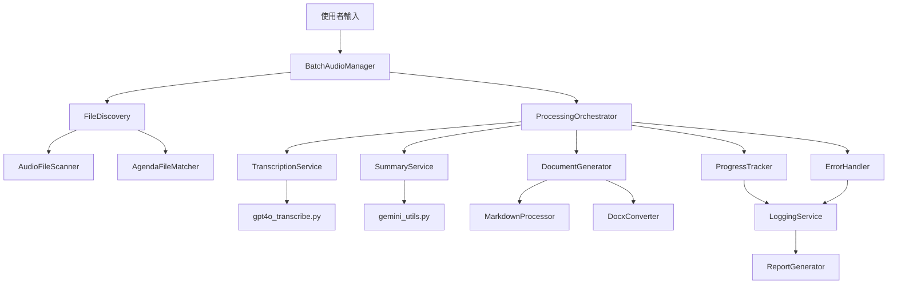

# Design Document

## Overview

本設計文件描述了一個完整的批次音訊處理系統，該系統將整合現有的 `gpt4o_transcribe.py` 和 `gemini_utils.py` 工具，提供統一的批次處理介面。系統採用模組化設計，支援遞歸檔案搜索、並行處理、錯誤恢復和詳細的進度報告。

系統的核心理念是重用現有的穩定組件，同時提供更好的使用者體驗和更強的錯誤處理能力。設計將支援兩種使用模式：
1. **整合模式**：創建一個新的統一處理器，內部呼叫現有工具
2. **模組化模式**：重構現有的 `batch_audio_processor.py`，使其更好地利用現有工具

## Architecture

### 系統架構圖



### 核心組件

1. **BatchAudioManager**: 主要的協調器，負責整個處理流程
2. **FileDiscovery**: 檔案發現和匹配服務
3. **ProcessingOrchestrator**: 處理流程編排器
4. **TranscriptionService**: 轉錄服務包裝器
5. **SummaryService**: 摘要服務包裝器
6. **DocumentGenerator**: 文件生成器
7. **ProgressTracker**: 進度追蹤器
8. **ErrorHandler**: 錯誤處理器

## Components and Interfaces

### 1. BatchAudioManager

主要的入口點和協調器類別。

```python
class BatchAudioManager:
    def __init__(self, config: ProcessingConfig):
        self.config = config
        self.file_discovery = FileDiscovery()
        self.orchestrator = ProcessingOrchestrator(config)
        self.progress_tracker = ProgressTracker()
        self.error_handler = ErrorHandler()
    
    def process_folder(self, folder_path: str) -> ProcessingResult:
        """處理整個資料夾"""
        pass
    
    def process_files(self, file_paths: List[str]) -> ProcessingResult:
        """處理指定的檔案列表"""
        pass
```

### 2. FileDiscovery

負責檔案發現和匹配的服務。

```python
class FileDiscovery:
    def __init__(self):
        self.audio_scanner = AudioFileScanner()
        self.agenda_matcher = AgendaFileMatcher()
    
    def discover_files(self, folder_path: str) -> DiscoveryResult:
        """發現音訊檔案和對應的議程檔案"""
        pass
    
    def match_agenda_files(self, audio_files: List[str], text_files: List[str]) -> Dict[str, str]:
        """匹配音訊檔案和議程檔案"""
        pass
```

### 3. ProcessingOrchestrator

處理流程的編排器，負責協調各個處理步驟。

```python
class ProcessingOrchestrator:
    def __init__(self, config: ProcessingConfig):
        self.config = config
        self.transcription_service = TranscriptionService(config)
        self.summary_service = SummaryService(config)
        self.document_generator = DocumentGenerator(config)
    
    def process_single_file(self, file_info: FileInfo) -> FileProcessingResult:
        """處理單一檔案"""
        pass
    
    def process_batch(self, file_infos: List[FileInfo]) -> BatchProcessingResult:
        """批次處理多個檔案"""
        pass
```

### 4. TranscriptionService

轉錄服務的包裝器，支援多種轉錄後端和自動備用機制。

```python
class TranscriptionService:
    def __init__(self, config: ProcessingConfig):
        self.config = config
        self.api_key = os.getenv('OPENAI_API_KEY')
    
    def transcribe_audio(self, file_path: str) -> TranscriptionResult:
        """使用 gpt4o_transcribe.py 進行轉錄"""
        pass
    
    def transcribe_large_audio(self, file_path: str) -> TranscriptionResult:
        """處理大型音訊檔案的轉錄，自動分割和合併"""
        pass
```

### 5. SummaryService

摘要服務的包裝器，負責呼叫現有的 `gemini_utils.py`。

```python
class SummaryService:
    def __init__(self, config: ProcessingConfig):
        self.config = config
        self.api_key = os.getenv('GOOGLE_API_KEY')
    
    def generate_summary(self, transcript: str, agenda: Optional[str] = None) -> SummaryResult:
        """使用 gemini_utils.py 生成摘要"""
        pass
    
    def enhance_with_images(self, summary: str, audio_folder: str) -> str:
        """在摘要中插入圖片標記"""
        pass
```

### 6. DocumentGenerator

文件生成器，負責將處理結果轉換為各種格式。

```python
class DocumentGenerator:
    def __init__(self, config: ProcessingConfig):
        self.config = config
        self.markdown_processor = MarkdownProcessor()
        self.docx_converter = DocxConverter()
    
    def generate_documents(self, processing_result: FileProcessingResult) -> DocumentResult:
        """生成各種格式的文件"""
        pass
    
    def generate_markdown(self, content: str) -> str:
        """生成 Markdown 格式"""
        pass
    
    def generate_docx(self, content: str, output_path: str) -> bool:
        """生成 Word 文件"""
        pass
```

## Data Models

### 配置模型

```python
@dataclass
class ProcessingConfig:
    transcription_model: str = "gpt-4o-mini-transcribe"
    output_format: str = "markdown"
    max_workers: int = 2
    enable_parallel: bool = True
    retry_attempts: int = 3
    retry_delay: float = 2.0
    max_file_size_mb: int = 25
    segment_duration_seconds: int = 300
    enable_combined_output: bool = False
    enable_srt_support: bool = True

    gemini_model: str = "gemini-2.5-pro-preview-06-05"
    
@dataclass
class APIConfig:
    openai_api_key: str
    google_api_key: str
    rate_limit_delay: float = 1.0
```

### 檔案資訊模型

```python
@dataclass
class FileInfo:
    audio_path: str
    audio_name: str
    agenda_path: Optional[str] = None
    agenda_content: Optional[str] = None
    file_size_mb: float = 0.0
    estimated_duration: Optional[float] = None

@dataclass
class DiscoveryResult:
    audio_files: List[str]
    text_files: List[str]
    matched_pairs: Dict[str, str]
    unmatched_audio: List[str]
    total_size_mb: float
```

### 處理結果模型

```python
@dataclass
class TranscriptionResult:
    success: bool
    content: str
    error: Optional[str] = None
    processing_time: float = 0.0
    token_count: Optional[int] = None

@dataclass
class SummaryResult:
    success: bool
    content: str
    error: Optional[str] = None
    processing_time: float = 0.0
    token_count: Optional[int] = None

@dataclass
class FileProcessingResult:
    file_info: FileInfo
    transcription: TranscriptionResult
    summary: SummaryResult
    documents: Dict[str, str]  # format -> file_path
    total_time: float
    success: bool
    error: Optional[str] = None

@dataclass
class BatchProcessingResult:
    total_files: int
    successful_files: int
    failed_files: int
    results: List[FileProcessingResult]
    total_processing_time: float
    report_path: str
```

## Error Handling

### 錯誤分類

1. **檔案系統錯誤**
   - 檔案不存在
   - 權限不足
   - 磁碟空間不足

2. **API 錯誤**
   - API 金鑰無效
   - 配額超限
   - 網路連線問題
   - 暫時性服務不可用

3. **處理錯誤**
   - 音訊格式不支援
   - 檔案損壞
   - 轉換失敗

### 錯誤處理策略

```python
class ErrorHandler:
    def __init__(self, config: ProcessingConfig):
        self.config = config
        self.retry_strategies = {
            'api_error': self._handle_api_error,
            'file_error': self._handle_file_error,
            'processing_error': self._handle_processing_error
        }
    
    def handle_error(self, error: Exception, context: str) -> ErrorHandlingResult:
        """統一的錯誤處理入口"""
        pass
    
    def _handle_api_error(self, error: Exception) -> bool:
        """處理 API 相關錯誤，返回是否應該重試"""
        pass
    
    def _should_retry(self, error: Exception, attempt: int) -> bool:
        """判斷是否應該重試"""
        pass
```

### 重試機制

- **指數退避**：重試間隔逐漸增加
- **最大重試次數**：避免無限重試
- **錯誤分類重試**：不同錯誤類型採用不同重試策略

## Testing Strategy

### 單元測試

1. **檔案發現測試**
   - 測試各種檔案結構的搜索
   - 測試議程檔案匹配邏輯
   - 測試邊界條件（空資料夾、無權限等）

2. **服務包裝器測試**
   - 模擬 API 呼叫
   - 測試錯誤處理
   - 測試重試機制

3. **文件生成測試**
   - 測試 Markdown 到 Word 的轉換
   - 測試格式保持
   - 測試特殊字符處理

### 整合測試

1. **端到端測試**
   - 使用測試音訊檔案進行完整流程測試
   - 驗證輸出檔案的正確性
   - 測試並行處理

2. **API 整合測試**
   - 測試與 OpenAI API 的整合
   - 測試與 Google Gemini API 的整合
   - 測試 API 限制處理

### 效能測試

1. **負載測試**
   - 測試大量檔案的處理能力
   - 測試記憶體使用情況
   - 測試並行處理效能

2. **壓力測試**
   - 測試 API 限制下的行為
   - 測試網路不穩定情況
   - 測試系統資源不足情況

### 測試資料準備

```python
class TestDataManager:
    def __init__(self):
        self.test_audio_files = [
            "test_short.mp3",  # < 1 分鐘
            "test_medium.wav", # 5-10 分鐘
            "test_large.m4a",  # > 25MB
        ]
        self.test_agenda_files = [
            "agenda.txt",
            "schedule.md",
            "program.docx"
        ]
    
    def create_test_structure(self, base_path: str):
        """創建測試用的檔案結構"""
        pass
    
    def cleanup_test_data(self, base_path: str):
        """清理測試資料"""
        pass
```

### 模擬和存根

```python
class MockTranscriptionService:
    def transcribe_audio(self, file_path: str) -> TranscriptionResult:
        """模擬轉錄服務"""
        return TranscriptionResult(
            success=True,
            content="Mock transcription content",
            processing_time=1.0
        )

class MockSummaryService:
    def generate_summary(self, transcript: str, agenda: Optional[str] = None) -> SummaryResult:
        """模擬摘要服務"""
        return SummaryResult(
            success=True,
            content="Mock summary content",
            processing_time=0.5
        )
```

## Additional Features Integration

### 組合輸出模式 (Combined Output Mode)

基於 `audio_auto.sh` 和 `batch_processor_cli.py` 的功能，系統將支援組合輸出模式：

1. **SRT 組合模式**
   - 將所有音訊檔案的轉錄合併為單一 SRT 檔案
   - 連續時間戳記跨越所有檔案
   - 檔案標題分隔符

2. **文字/Markdown 組合模式**
   - 檔案標題作為分隔符
   - 內容分離但保持格式一致性

### GPT-4o 轉錄整合

```python
class GPT4oTranscriptionService:
    def __init__(self, config: ProcessingConfig):
        self.config = config
        self.api_key = os.getenv('OPENAI_API_KEY')
    
    def transcribe(self, file_path: str) -> TranscriptionResult:
        """使用 audio2text/gpt4o_stt.py 進行轉錄"""
        # 呼叫現有的 transcribe_audio_gpt4o 函數
        pass
    
    def handle_large_file(self, file_path: str) -> TranscriptionResult:
        """處理大型檔案，使用 utils.py 的分割功能"""
        # 使用 split_large_audio 和 check_file_size
        pass
```

### 增強的文件處理

```python
class EnhancedDocumentProcessor:
    def __init__(self):
        self.markitdown_processor = MarkItDownProcessor()
        self.image_analyzer = ImageAnalyzer()
    
    def process_agenda_file(self, file_path: str) -> str:
        """使用 markitdown_utils.py 處理各種格式的議程檔案"""
        pass
    
    def analyze_images(self, image_folder: str) -> Dict[str, str]:
        """使用 image_analyzer.py 分析投影片圖片"""
        pass
```

### Shell 腳本整合

系統將提供 Python API 和 Shell 腳本兩種介面：

```bash
# Python API
python enhanced_batch_processor.py folder_path --model gpt-4o-mini-transcribe --format srt --combined

# Shell 腳本包裝器
./enhanced_audio_auto.sh folder_path gpt-4o-mini-transcribe srt --combined
```

## Implementation Considerations

### 現有程式碼重用

1. **gpt4o_transcribe.py 整合**
   - 保持現有的 API 介面
   - 添加錯誤處理包裝
   - 支援批次呼叫優化

2. **gemini_utils.py 整合**
   - 擴展現有的 `call_gemini_api` 函數
   - 添加專門的摘要提示詞
   - 支援圖片標記處理

3. **utils.py 功能利用**
   - 重用檔案大小檢查邏輯 (`check_file_size`, `check_file_constraints`)
   - 重用音訊分割功能 (`split_large_audio`)
   - 重用 token 計算功能 (`calculate_tokens_and_cost`)

4. **audio2text/gpt4o_stt.py 整合**
   - 重用標準化的轉錄介面 (`transcribe_audio_gpt4o`)
   - 支援多種輸出格式 (text, srt, markdown)
   - 統一的錯誤處理機制

5. **batch_processor_cli.py 參考**
   - 重用並行處理架構 (`ThreadPoolExecutor`)
   - 重用進度追蹤機制 (`tqdm`)
   - 重用報告生成邏輯

6. **markitdown_utils.py 文件處理**
   - 通用文件轉換器
   - 支援多種議程檔案格式
   - 圖片豐富文件處理

7. **audio_auto.sh 腳本整合**
   - 提供命令列包裝器
   - 支援組合輸出模式 (--combined)
   - 自動模型選擇和檔案分割

### 效能優化

1. **並行處理**
   - 使用 ThreadPoolExecutor 進行並行轉錄
   - 控制並行度避免 API 限制
   - 實施智能排程

2. **記憶體管理**
   - 流式處理大型檔案
   - 及時清理臨時檔案
   - 監控記憶體使用

3. **API 優化**
   - 實施速率限制
   - 使用連接池
   - 快取常用結果

### 可擴展性設計

1. **插件架構**
   - 支援新的轉錄服務
   - 支援新的摘要服務
   - 支援新的輸出格式

2. **配置驅動**
   - 外部化配置參數
   - 支援環境特定配置
   - 支援運行時配置更新

3. **監控和日誌**
   - 結構化日誌記錄
   - 效能指標收集
   - 錯誤統計和報告